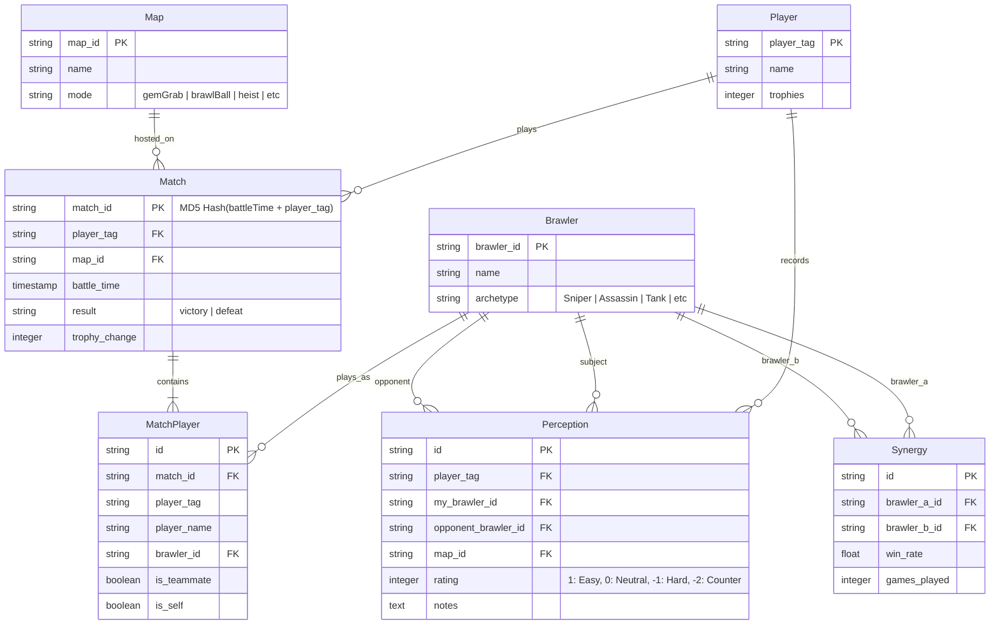

# 📐 Technical Architecture: Ranked Draft Assistant & Experience Logger

This document defines the software architecture, database schema, and mathematical algorithms for a personalized Brawl Stars Ranked Draft Assistant. The system implements a **multiplicative scoring model** using **Bayesian smoothing**, **confidence penalties**, **exponential time decay**, and a **post-match feedback loop** to serve dynamic pick/ban recommendations tailored to your playstyle.

---

## 🗂️ 1. Core Domain Entities

To maintain clean and standardized abstractions, all database models and codebase representations will use English naming conventions:

1.  **Player**: The active player profile (you) tracking stats, preferences, and historical tags.
2.  **Brawler**: Directory of all brawlers, their base attributes, and meta classification.
3.  **Map**: Game maps containing properties like name, mode, and openness (long-range vs. closed-range).
4.  **Match**: Individual games played, containing game mode, map, duration, outcome, and timestamps.
5.  **Draft**: Sequential record of locks (bans and picks) during a match setup.
6.  **Perception**: Subjective post-match feedback mapping your comfort/difficulty rating against a specific opponent brawler.

---

## 🛢️ 2. Database Schema (SQLite / PostgreSQL)



---

## 🧮 3. Mathematical Recommendation Engine

During the Draft phase, for each candidate brawler $b$ (that is not banned, not picked, and unlocked by the player), the engine calculates a recommendation score:

$$\text{Score}(b) = A \times B \times C \times D \times E$$

---

### Component A: Adjusted Win Rate (Bayesian Beta Smoothing)
To avoid small-sample size bias (e.g., a brawler with $1$ game and $1$ win showing $100\%$ win rate), we apply a **Beta Prior** derived from the global meta win rate:

$$\text{Score}_A(b) = \frac{\text{Wins}_{\text{player}}(b) + \alpha_{\text{prior}}}{\text{Games}_{\text{player}}(b) + \alpha_{\text{prior}} + \beta_{\text{prior}}}$$

Where:
*   $\text{Prior Games Equivalent} = 20$ (Configurable parameter: represents the weight of the global meta).
*   $\alpha_{\text{prior}} = \text{WinRate}_{\text{meta}}(b, \text{map}) \times \text{Prior Games Equivalent}$
*   $\beta_{\text{prior}} = (1 - \text{WinRate}_{\text{meta}}(b, \text{map})) \times \text{Prior Games Equivalent}$

*Behavior*: With $0$ personal games, $\text{Score}_A$ equals the meta win rate. With $>50$ personal games, the score is dominated by your actual performance.

---

### Component B: Matchup Factor
For each locked-in enemy brawler $o \in O_{\text{picked}}$:
1.  **Fallback 1 (Perception)**: If a personal `Perception(player, b, o)` exists:
    *   `Easy` $\rightarrow 1.15$
    *   `Neutral` $\rightarrow 1.00$
    *   `Hard` $\rightarrow 0.85$
    *   `Counter` $\rightarrow 0.65$
2.  **Fallback 2 (Personal History)**: If no perception exists but there is historical empirical data ($b$ vs $o$):
    *   $\text{Rating} = \text{WinRate}_{\text{player}}(b \text{ vs } o)$
3.  **Fallback 3 (Global Meta Matchup)**: If no data exists:
    *   $\text{Rating} = 1.0 + (\text{WinRate}_{\text{meta}}(b \text{ vs } o) - 0.5) \times 0.40$ (scaled to 40% weight).

The total matchup factor is the product of individual match factors:

$$B = \prod_{o \in O_{\text{picked}}} \text{Rating}(b, o)$$

---

### Component C: Synergy Factor
For each locked-in ally brawler $a \in A_{\text{picked}}$:
1.  Query historical matches where $b$ and $a$ played together on the same team.
2.  Calculate the combined win rate.
3.  If $\text{GamesTogether}(b, a) < 5$, default the synergy factor to $1.0$ (neutral).

The total synergy factor is the average of individual pairings:

$$C = \frac{1}{|A_{\text{picked}}|} \sum_{a \in A_{\text{picked}}} \text{SynergyRate}(b, a)$$

---

### Component D: Global Meta Relevance
Direct statistical relevance of brawler $b$ on the current map and mode:

$$D = \text{WinRate}_{\text{meta}}(b, \text{map})$$

---

### Component E: Confidence Penalty
Avoids recommending a brawler you have barely played, even if they have a $100\%$ win rate:

$$E = \begin{cases} 
      0.70 & \text{if } \text{Games}_{\text{player}}(b) = 0 \\
      0.85 & \text{if } 0 < \text{Games}_{\text{player}}(b) < 5 \\
      0.93 & \text{if } 5 \le \text{Games}_{\text{player}}(b) < 15 \\
      1.00 & \text{if } \text{Games}_{\text{player}}(b) \ge 15 
   \end{cases}$$

---

### ⏱️ 4. Temporal Decay
All historical calculations apply an exponential decay weight to matches based on age:

$$\text{Weight}(\text{match}) = e^{-\lambda \cdot t}$$

Where:
*   $t$ is the age of the match in days.
*   $\lambda = 0.01$ (Soft decay: a 70-day-old match is worth $\approx 50\%$).
*   $\lambda = 0.02$ (Aggressive decay: a 35-day-old match is worth $\approx 50\%$).
*   **Patch Adjustment**: When a game balance patch is flagged, $\lambda$ is temporarily boosted for all matches played before the patch date to quickly wash out outdated metrics.

---

### 📈 5. Trend Analysis (Dashboard)
To calculate whether your performance with a Brawler is improving or decaying:
1.  Group matches into weekly windows.
2.  Calculate the win rate per window.
3.  Fit a simple linear regression line (least squares method) to obtain the slope $m$:
    *   If $m > +0.03 \text{ per week} \rightarrow \text{Improving } (\uparrow)$
    *   If $m < -0.03 \text{ per week} \rightarrow \text{Decaying } (\downarrow)$
    *   If $-0.03 \le m \le +0.03 \rightarrow \text{Stable } (\rightarrow)$

---

## 🔄 6. Draft Workflow Integration

```
                 Draft Phase Starts
                         │
                         ▼
             Set Map / Mode Selection
                         │
                         ▼
             Calculate Base Candidates (A × D × E)
                         │
                         ▼
             [Loop: Lock Ban or Pick] ◄──────────────┐
                         │                           │
                         ▼                           │
             Compute Dynamic Factors (B × C)         │
                         │                           │
                         ▼                           │
             Recalculate Final Scores                │
             (Sort & Display Top 5)                  │
                         │                           │
                         ▼                           │
           Is Draft Completed? (No) ─────────────────┘
                         │
                     Yes │
                         ▼
                 Match In Progress
                         │
                         ▼
          Sync Daemon Detects Match Ends
                         │
                         ▼
             Trigger Post-Match Logger
       (User inputs subjective perceptions)
                         │
                         ▼
        Recalculate Bayesian & Decay Indices
```

---

## 🛠️ 7. Target Implementation Names

### Core Models (TypeScript / Python)
*   `PlayerProfile` (tag, name, trophies)
*   `BrawlerStats` (brawlerId, name, archetype)
*   `MapDefinition` (mapId, name, mode)
*   `BattleRecord` (matchId, result, battleTime)
*   `OpponentPerception` (myBrawlerId, opponentBrawlerId, rating, mapId)
*   `DuoSynergy` (brawlerAId, brawlerBId, winRate)

### Engine Functions
*   `calculateBayesianWinRate(wins: number, games: number, metaWinRate: number): number`
*   `evaluateMatchupFactor(myBrawler: string, activeOpponents: string[]): number`
*   `evaluateSynergyFactor(myBrawler: string, activeAllies: string[]): number`
*   `applyConfidencePenalty(gamesPlayed: number): number`
*   `calculateTemporalWeight(daysOld: number, isPrePatch: boolean): number`
*   `calculatePerformanceTrend(brawlerId: string): 'improving' | 'stable' | 'decaying'`
